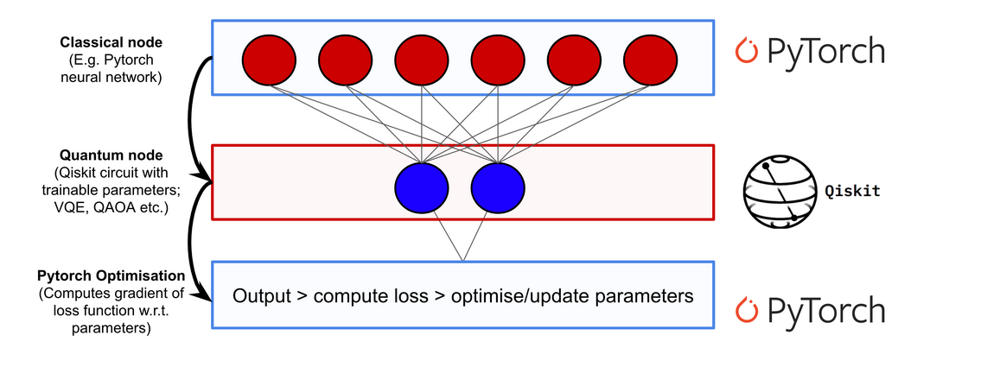
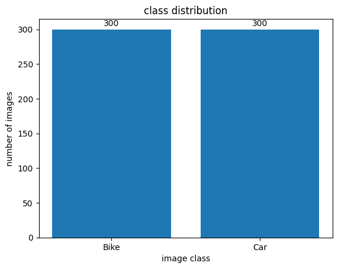
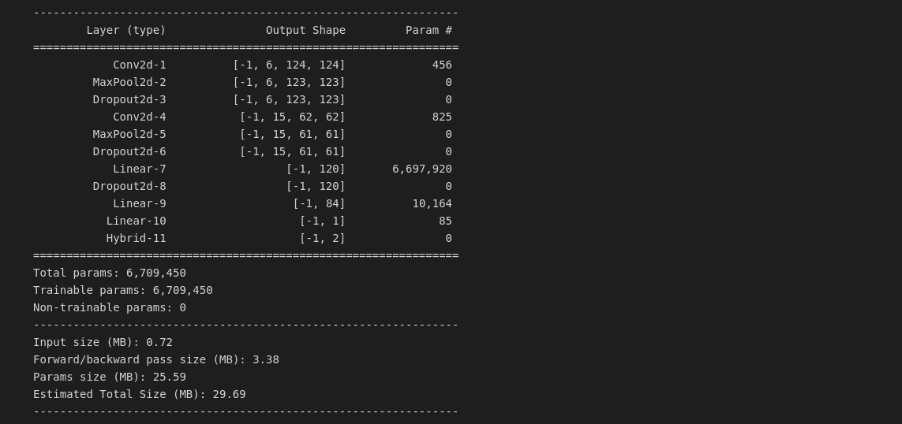
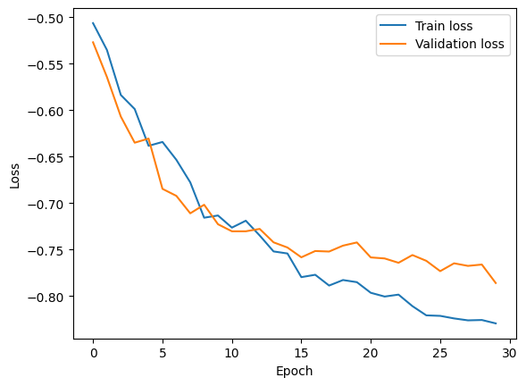
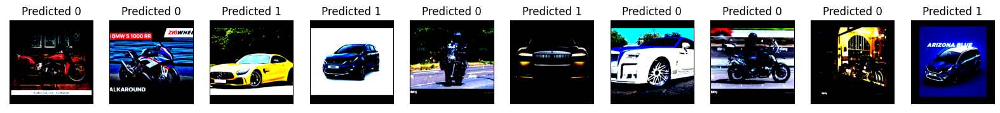

# Hybrid Quantum Neural Network for binary classification with qiskit

The purpose of this project is to investigate the structure of a hybrid neural network. To do this, I made use of the *qiskit* library, which allows useful tools for constructing a classical-quantum neural network.

The dataset used to build the network is available from the following [link](https://www.kaggle.com/datasets/utkarshsaxenadn/car-vs-bike-classification-dataset).

## What is quantum computing?

Quantum computing is a type of computing that uses quantum mechanical phenomena, such as superposition and entanglement, to perform operations on data. Instead of using classical bits that can only be in a state of 0 or 1, quantum computing uses quantum bits (qubits) that can be in multiple states at once. This allows quantum computers to process certain types of problems exponentially faster than classical computers.

Some potential advantages of quantum computing include:

- *Faster computations*: Quantum computers have the potential to solve certain types of problems exponentially faster than classical computers. This includes problems such as factorization of large numbers, which is the basis of many encryption schemes used today.
- *Improved simulation capabilities*: Quantum computers have the potential to simulate quantum mechanical systems more efficiently than classical computers, which could have applications in areas such as materials science, drug discovery, and machine learning.
- *Improved optimization*: Quantum computers have the potential to optimize complex functions more efficiently than classical computers, which could have applications in areas such as finance, logistics, and energy management.

However, it's worth noting that quantum computing is still in the early stages of development and faces a number of challenges. These include the difficulty of building stable and reliable quantum systems, the need for specialized hardware and software, and the need to develop new algorithms that can take advantage of quantum properties. Nonetheless, the potential advantages of quantum computing have generated significant interest and investment from both industry and academia.

## What is Quantum Machine Learning?

Several areas of scientific research on quantum computation are focusing their attention on **Quantum Machine Learning (QML)**, a relatively novel discipline that brings together concepts from *Machine Learning (ML)*, *Quantum Computing (QC)* and *Quantum Information (QI)*. The great development experienced by QC, partly due to the involvement of giant technological companies as well as the popularity and success of ML have been responsible of making QML one of the main streams for researchers working on fuzzy borders between Physics, Mathematics and Computer Science.

Before we delve into the construction of the hybrid network, let us expose the advantages and main differences between a classical neural network and a network making use of quantum computation.

A quantum neural network (QNN) is a type of neural network that uses quantum mechanics to perform computations. Like classical neural networks, QNNs consist of layers of interconnected nodes or neurons, where each neuron receives input from other neurons and produces output to be fed to the next layer. However, in QNNs, these neurons are implemented using quantum bits, or qubits, which can exist in multiple states at the same time, unlike classical bits which can only exist in one state (either 0 or 1). The use of qubits in QNNs allows for quantum entanglement and interference effects to be exploited, which can lead to significant performance improvements in certain applications.

Quantum neural networks (QNNs) have the potential to outperform classical neural networks in certain tasks due to the fundamental differences between the two architectures.

One of the main advantages of QNNs is their ability to perform computations in parallel through quantum entanglement. This means that multiple computations can be performed simultaneously, leading to faster and more efficient processing than classical computers. Additionally, QNNs can leverage quantum interference, which allows for constructive and destructive interference patterns that can enhance or suppress certain computations, depending on their specific quantum state. This interference can lead to more precise and accurate predictions in certain applications.

Another advantage of QNNs is their potential for exponential speedup in certain algorithms, such as factorization, search, and optimization problems, when compared to classical algorithms. This is due to the ability of QNNs to exploit quantum entanglement and interference in the computation of certain problems. However, it is important to note that QNNs are still in their early stages of development, and their practical implementation remains a significant challenge.

In this project, we're looking at how we can combine classical and quantum computing to create a new type of neural network. Specifically, we'll partially convert a classical neural network to a quantum neural network to create a hybrid quantum-classical neural network. We'll use two popular software packages - **Qiskit** and **PyTorch** - to create a simple example that shows how to integrate quantum computing with existing machine learning tools. Our goal is to demonstrate how easy it is to use Qiskit with existing ML tools and to inspire machine learning practitioners to explore the possibilities of quantum computing.

To combine quantum and classical neural networks, we can add a hidden layer to our neural network that uses a special type of quantum circuit called a "parameterized quantum circuit". This circuit uses a classical input vector to set the rotation angles of the quantum gates. The output from the previous layer of our neural network is sent to this parameterized circuit as input. We collect the measurement statistics from the quantum circuit, and use them as inputs for the next layer of our neural network. This process is repeated until we reach the final output layer. This can be illustrated with a simple example:

Here, $\sigma$ is a nonlinear functionand hi is the value of neuron i at each hidden layer. $R(h_i)$ represents any rotation gate about an angle equal to $h_i$ and $y$ is the final prediction value generated from the hybrid network.

#### How do we calculate gradients when quantum circuits are involved?

In his paper, [Gavin E. Crooks](https://arxiv.org/pdf/1905.13311.pdf), showed how it is possible to extend the powerful optimization technique of gradient descent to the quantum case as well. The author calls this technique **the parameter shift rule**. In short, we can view a quantum circuit as a black box and the gradient of this black box with respect to its parameters can be calculated as follows:

$$
\nabla_\theta QC(\theta) = QC(\theta + s) - QC(\theta -s)
$$

where $\theta$ represents the parameters of the quantum circuit and $s$ is a macroscopic shift. The gradient is then simply the difference between our quantum circuit evaluated at $\theta+s$ and $\theta−s$. Thus, we can systematically differentiate our quantum circuit as part of a larger backpropagation routine.

## Model-building phase

Readers are invited to read the jupyter [notebook](Classical-Quantum Neural Network for binary classification.ipynb) containing the details of the entire building phase.
As a first step, *exploratory data analysis* (EDA) and *preprocessing* of the images contained in the dataset were carried out. As can be seen, not all the images contained in the original dataset on the *kaggle* site were used, but only a portion of them: specifically, 300 images were taken for each class. From this it follows that the dataset used turns out to be balanced with respect to the classes.

The quantum neural network consists of a sequence of 11 layers:

At this point, we moved on to the network training phase using the following hyperparameters:

- a number of *epoches* equal to $30$.
- a *batch_size* equal to $1$.
- an initial learning rate equal to $0.00001$.
- a *$L_2$ regularization factor* equal to $0.001$.

All using the optimizer the *Adam* and as a loss function the *Negative Log-Likelihood*.

The image of the loss curves of training and validation is presented below.

As can be seen from the graphs, the loss curves have maintained an optimal trend without leaving the suspicion of any possible underfitting and overfitting error. A final value of *NLL* of $-0.83$ for the training set and $-0.79$ for the validation set was reached.

## Results

The good results obtained in the training phase of the model were repeated in the testing phase; in fact, by testing the model on the images of the test set, we were able to obtain a value of *NLL* equal to $-0.78$ and a value of *accuracy* equal to $86.7\%$.
Some predictions on images from the test set are given below.

## References

- [Hybrid quantum-classical Neural Networks with PyTorch and Qiskit](https://qiskit.org/textbook/ch-machine-learning/machine-learning-qiskit-pytorch.html)

- [Quantum Machine Learning: A tutorial](https://idus.us.es/bitstream/handle/11441/128549/1-s2.0-S0925231221011000-main.pdf?sequence=1&isAllowed=y)